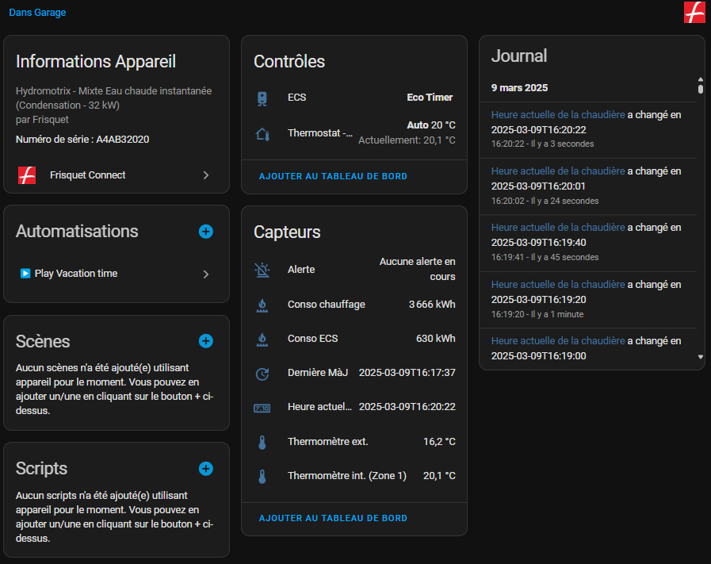
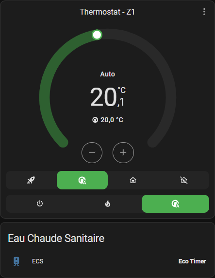

[![HACS Custom][hacs_shield]][hacs]
[](https://github.com/home-assistant-custom-components/frisquet-connect/releases/)

[hacs_shield]: https://img.shields.io/static/v1.svg?label=HACS&message=Custom&style=popout&color=orange&labelColor=41bdf5&logo=HomeAssistantCommunityStore&logoColor=white
[hacs]: https://hacs.xyz/docs/faq/custom_repositories

# Frisquet Connect "Unofficial" For Home Assistant




## Installation

### HACS

Frisquet Connect "Yet Another Unofficial" is available in HACS (Home Assistant Community Store).

#### Automatic way

[](https://my.home-assistant.io/redirect/hacs_repository/?owner=home-assistant-custom-components&repository=frisquet-connect)

#### Manual way

1. Install HACS if you don't have it already
2. Open HACS in Home Assistant
3. Search for "Frisquet Connect"
4. Click the download button. ⬇️

### local install

1. Copy the folder `frisquet_connect` into your `custom_components` folder<br>
2. Restart HA and add the integration `Frisquet Connect` from Device -> Add integration<br>
3. Enter your credential (_email & password_)<br>

## Features : Frisquet vs HA logic

### Multi-zone supported

- Temperature sensors associated
- Water heater
- External the temperature sensor **if available**.

### HVAC Modes
  - Auto: Mainly usage, with exemption for all zones & boost per zone.
  - Heat: Use for permament mode (Comfort or Reduce), similar to manual mode without scheduling
  - Off: Use for frost protection only. It doens't turn off the boiler.

### Preset Modes

Depends on the HVAC mode selected

#### Auto

- Boost
- Exemption until next cycle with
  - Home
  - Away

#### Heat

- Comfort permanently
- Reduced permanently

#### Off

### Consumption :
  - Sanitary
  - Boiler

Both are in KiloWatt / hour, with a daily update.

## For local usage


### 1. Initialize

```powershell
python -m venv .venv
.\.venv\Scripts\Activate.ps1
pip install -r .\requirements.txt
```

### 2. Run tests & coverage
```
pytest --cov=. tests/
```

### 3. Misc for commit purpose (not available yet)
```
# https://pre-commit.com/
pre-commit autoupdate --repo https://github.com/pre-commit/pre-commit-hooks
pre-commit installed at .git/hooks/pre-commit
pre-commit install
```